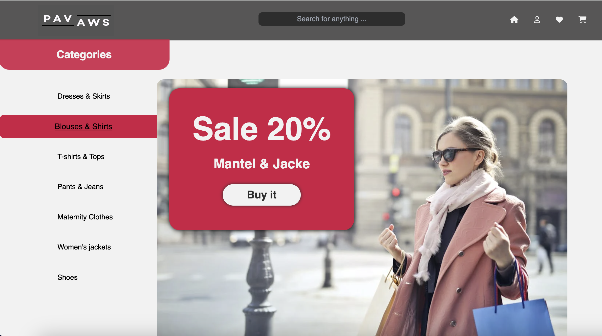

# PAVAWS E-Commerce Project

[Visit the website](https://e-commerce-5oox3i43p-alis-projects-b528478b.vercel.app/)


## Projektbeschreibung

Das 'PAVAWS' E-Commerce Projekt ist eine umfassende Online-Shopping-Plattform, entwickelt von den talentierten Studierenden der DCI 💻. Dieses Projekt zielt darauf ab, eine benutzerfreundliche und effiziente E-Commerce-Lösung zu bieten, die verschiedene Funktionen für eine nahtlose Einkaufserfahrung integriert.

## Entwicklerteam

- [Ali Hossaini](https://github.com/Hossaini1)
- [Anastasios Aintinidis](https://github.com/Taseos)
- [Viktoriia Kaliberda](https://github.com/kaliberda97)
- [Samira Hosseini](https://github.com/samiraHs)
- [Patrycja Wozniewicz](https://github.com/Patison82)
- [Andreas Stroianetki](https://github.com/Sandreass)

## Projektfunktionen

- **Produktkategorien:** Übersichtliche und strukturierte Darstellung der verschiedenen Produktkategorien.
- **Aktuelle Aktionen:** Anzeige von aktuellen Sonderangeboten und Rabatten.
- **Aktuelle Produkte:** Präsentation der neuesten Produkte im Sortiment.
- **Produktkarussell:** Attraktives Produktkarussell für eine visuelle Präsentation der Top-Produkte.
- **Kundenbewertungen:** Anzeige von Kundenfeedback und Bewertungen für die einzelnen Produkte.
- **Social Media Links:** Integration von Links zu den sozialen Medien für erweiterte Kundeninteraktion.
- **Kundenkonto:** Funktion zur Erstellung und Verwaltung von Kundenkonten.
- **Produktsuche nach Kategorien:** Leistungsfähige Suchfunktion, die das Finden von Produkten nach Kategorien erleichtert.
- **Einkaufswagen:** Benutzerfreundlicher Einkaufswagen für die Verwaltung von Bestellungen.
- **Produktbezahlung:** Sichere und zuverlässige Zahlungsabwicklung.
- **Favoriten:** Möglichkeit, Produkte zu favorisieren und später wiederzufinden.

## Installation

1. Repository klonen:
    ```sh
    git clone git@github.com:Hossaini1/e-commerce.git
    ```
2. In das Projektverzeichnis wechseln:
    ```sh
    cd PAVAWS
    ```
3. Abhängigkeiten installieren:
    ```sh
    npm install
    ```
4. Entwicklungsserver starten:
    ```sh
    npm run dev
    ```

## Technologie-Stack

- **Frontend:** [React.js](https://reactjs.org/)
  - **Buildtools:** [Vite](https://vitejs.dev/)
- **OMDb API:** Eine API zum Abrufen von Filminformationen, die für die Suche nach Filmtiteln verwendet wird.
- **Styling:** CSS, [Tailwind CSS](https://tailwindcss.com/)
- **Deployment:** [Vercel](https://vercel.com/)

## Projektstruktur

```plaintext
PAVAWS/
├── public/
├── src/
│   ├── components/
│   ├── pages/
│   ├── store/
│   ├── App.jsx
│   ├── index.css
│   ├── main.jsx
│   └── ...
├── .gitignore
├── package.json
├── README.md
└── ...

